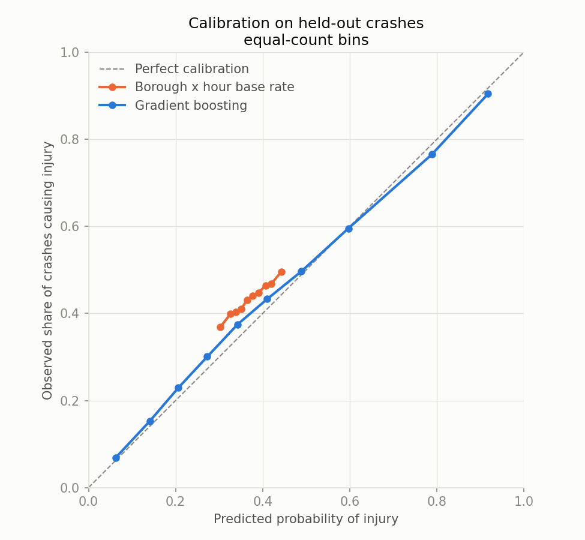

# Injury risk: results

Generated by `scripts/train_injury_risk.py`. Every figure below is
measured on crashes from after the test boundary, which neither the
model nor its calibration has seen.

## Folds

| Fold | Period | Crashes | Injury rate |
|---|---|---|---|
| Train | 2020-01-01 to 2023-12-31 | 423,970 | 0.358 |
| Calibration | 2024-01-01 to 2024-12-31 | 91,316 | 0.441 |
| Test | 2025-01-01 to 2026-06-11 | 121,970 | 0.432 |

## Baseline against model

| Predictor | ROC-AUC | Brier | Log loss | Mean predicted | Brier skill |
|---|---|---|---|---|---|
| Borough x hour base rate | 0.5425 | 0.2478 | 0.6891 | 0.371 | -- |
| Gradient boosting (uncalibrated) | 0.7947 | 0.1861 | 0.5504 | 0.365 | +24.9% |
| Gradient boosting | 0.7947 | 0.1811 | 0.5374 | 0.423 | +26.9% |

The observed injury rate on the test period is 0.432.

Brier skill is the share of the baseline's squared error removed.
The uncalibrated row is the same model without its level shift; the
gap between the two rows is what drift costs, and the identical
ROC-AUC is the point -- a level shift cannot reorder anything.

## What the model is using

Test ROC-AUC lost when each feature is shuffled, 5 repeats.

| Feature | AUC drop | SD |
|---|---|---|
| factor_2 | 0.0973 | 0.0003 |
| vehicle_2 | 0.0922 | 0.0007 |
| factor_1 | 0.0736 | 0.0010 |
| vehicle_1 | 0.0524 | 0.0004 |
| road_class | 0.0295 | 0.0005 |
| borough | 0.0053 | 0.0002 |
| hour | 0.0052 | 0.0001 |
| vehicle_count | 0.0050 | 0.0003 |
| month | 0.0025 | 0.0002 |
| at_intersection | 0.0013 | 0.0001 |
| weekday | 0.0005 | 0.0001 |

## Calibration

